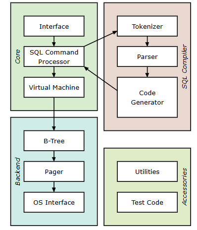

# SQLite的架构
## 一，介绍

SQLite的主要组件：

## 二，概述

SQLite的核心流程为SQL编译为字节码和虚拟机执行。

具体流程为:

**准备阶段:**

​	SQL文本通过 [sqlite3_prepare_v2()](https://www.sqlite.org/c3ref/prepare.html) 被编译为字节码，并储存在 [sqlite3_stmt](https://www.sqlite.org/c3ref/stmt.html) 对象中。

**执行阶段：**

​	`sqlite3_step()` 将字节码传递给虚拟机运行，按步执行查询，直到完成、生成结果行、遇到错误或中断。

## 三，架构层次

**1,接口层**：提供与用户交互的 C API 和扩展接口。

**2,解析层**：将 SQL 文本解析为语法树，处理语法与上下文。

**3,代码生成层**：将语法树转化为高效的字节码。

**4,虚拟机层**：通过 VDBE 执行字节码，完成查询和操作。

**5,存储引擎层**：使用 B-树和页面缓存管理磁盘上的数据。

**6,操作系统接口**：通过 VFS 实现跨平台兼容性。

**7,工具层**：为内部功能提供支持的实用工具。

**8,测试层**：用于验证功能的测试代码。

​	